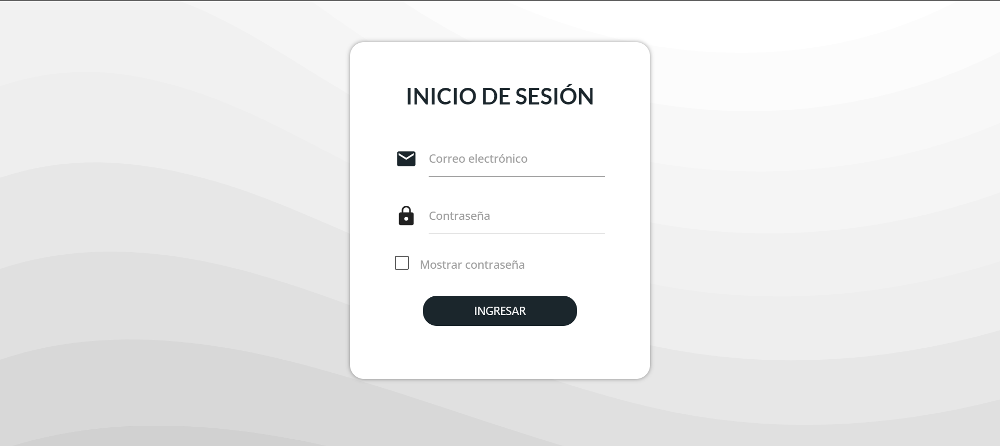
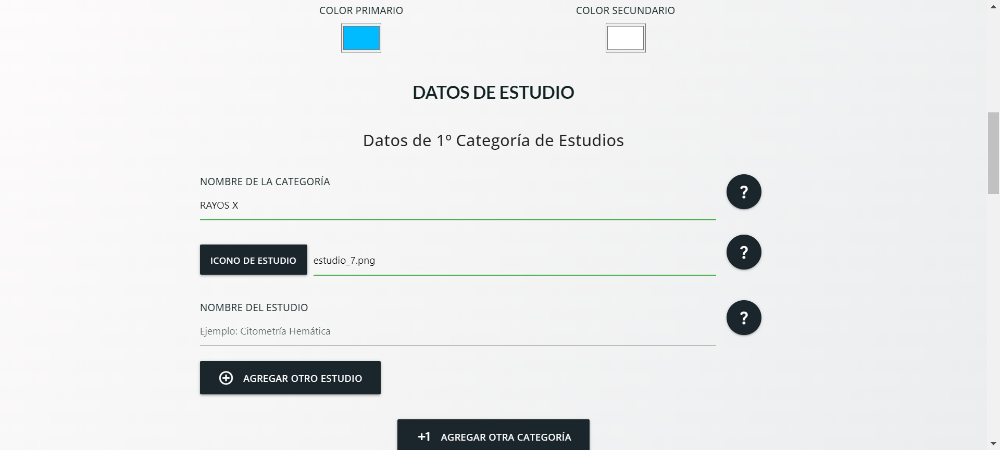
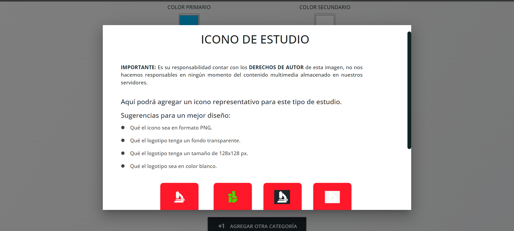
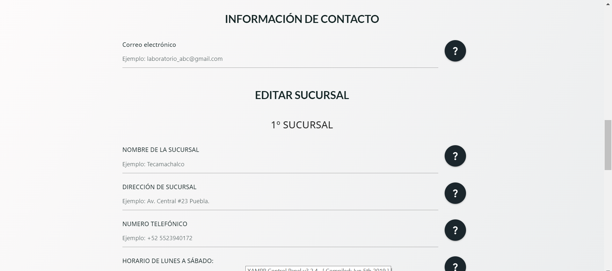
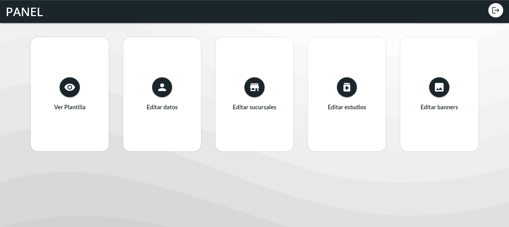
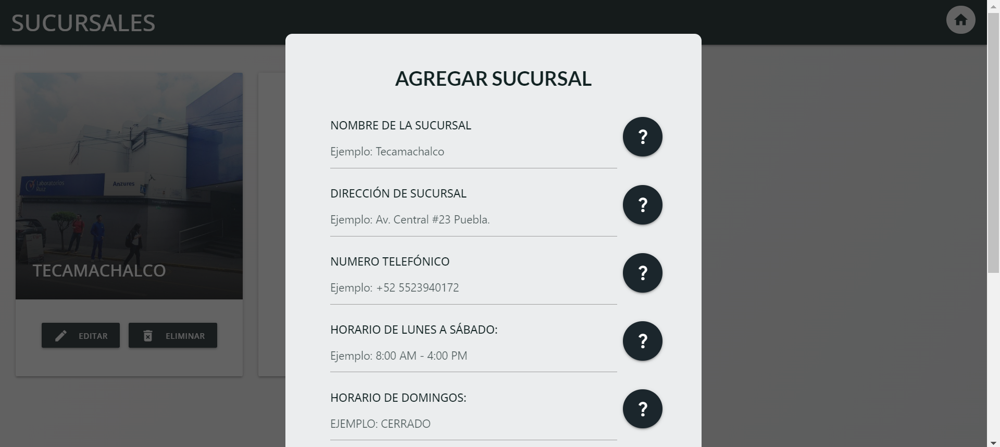
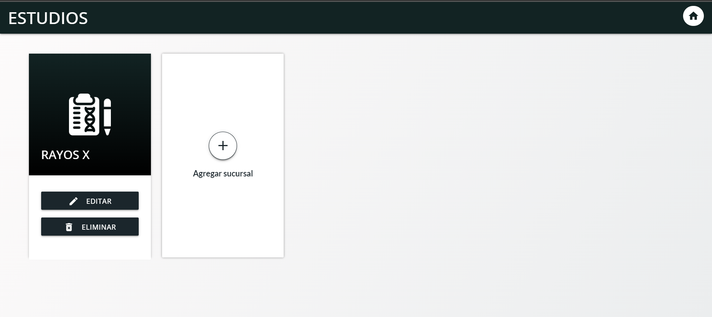

# SISTEMA EDITOR DE PLANTILLAS

**No puedo publicar el código o revelar información sobre el desarrollo de este proyecto de forma pública**.

Sin embargo, si puedo explicar su funcionamiento y mostrar capturas del resultado final.

El Sistema Editor de plantillas es una aplicación web, la cual contiene un panel de administrador donde un usuario sin conocimiento en desarrollo web puede modificar una gran cantidad de factores de una página web, desde su color, nombre, datos de contacto, imágenes, redes sociales, entre muchos otros.

# Capturas

